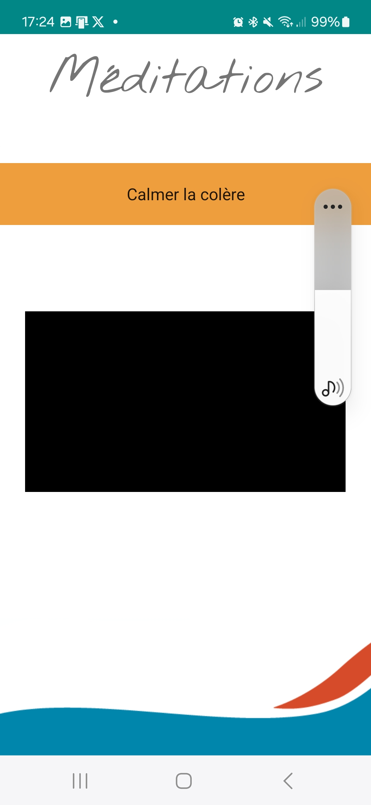

# Présentation du projet FemSanté

🚀 Développé sur Android en Kotlin (avec une volonté de déploiement sur SWIFT)/

💡 **Résumé**

Découvrez FemSanté, ton alliée pour une vie plus épanouissante ! Transforme ton bien-être chaque jour avec des exercices adaptés et des ressources expertes conçues par des expertes dans leur domaine. C'est bien plus qu'une simple application ! FemSanté est ton compagnon dédié pour une vie sans limites aux femmes ayant des soucis de santé.

🤝 **Partenariat**

Je suis fier de collaborer avec **[Audrey Retournay](https://www.audreyretournay-dieteticiennenutritionniste.com/)**, diététicienne spécialisée dans l'endometriose, le syndrome des ovaires polykystiques et les troubles digestifs pour offrir la meilleure expérience possible.

## 📌 Fonctionnalités principales  
- 🏗️ **Architecture modulaire** – Structure flexible et extensible pour afficher différents pdf
- ✅ **Validation automatique** – Assure que toutes les données sont correctes avant d'être insérées.
- ⚙️ **Gestion des erreurs** – Interface simple pour gérer les erreurs de manière centralisée.
- 📦 **Optimisation des requêtes** – Améliore les performances des requêtes SQL grâce à des techniques avancées.
- 🎥 **Vidéos avec des intervenates** - Cours de sports et méditations pour mieux vivre ses douleurs
- 📄 **PDF de recettes** – Recettes accompagnées de fichiers PDF pour mieux manger.
- 🎧 **Fichiers audio de méditations** - Accompagné d'un casque, une aide pour se poser

🔧 **Fonctionnement**

 Ecran de connexion à l'application

```Kotlin
class LoginActivity : AppCompatActivity() {

    private lateinit var menu: BottomNavigationView
    private var login = LoginFragment()
    private var doc = DocFragment()
    private var register = CreateFragment()

    override fun onCreate(savedInstanceState: Bundle?) {

        super.onCreate(savedInstanceState)

        checkInAppUpdate()

        setContentView(R.layout.activity_login)

        menu = findViewById(R.id.bottom_navigation_menu)

        supportFragmentManager.beginTransaction().replace(R.id.container, login).commit()

        menu.setOnItemSelectedListener { item ->

            when (item.itemId) {
                R.id.login ->{ supportFragmentManager.beginTransaction().replace(R.id.container, login)
                    .commit()
                    return@setOnItemSelectedListener true
                }
                R.id.pdf -> {
                    supportFragmentManager.beginTransaction().replace(R.id.container, doc)
                        .commit()
                    return@setOnItemSelectedListener true
                }
                R.id.register -> {
                    supportFragmentManager.beginTransaction().replace(R.id.container, register)
                        .commit()
                    return@setOnItemSelectedListener true
                }
            }

            return@setOnItemSelectedListener false

        }
    }
```

 Proposition des différentes options de l'utilisateur

On peut voir dans ce menu principal la variété des choix et des thèmes utilisés. Il est donc possible d'avoir des options pour le corps, pour la tête, pour les repas et aussi des plus génériques. 

```Kotlin
class MainMenuFragment : Fragment() {

    private lateinit var tete: Button
    private lateinit var corps: Button
    private lateinit var outils: Button
    private lateinit var alim : Button

    override fun onCreateView(
        inflater: LayoutInflater,
        container: ViewGroup?,
        savedInstanceState: Bundle?
    ): View? {
        super.onCreate(savedInstanceState)
        val view = inflater.inflate(layout.fragment_main, container, false)
        alim = view.findViewById(R.id.buttonAlim)
        tete = view.findViewById(R.id.buttonTete)
        corps = view.findViewById(R.id.buttonCorps)
        outils = view.findViewById(R.id.buttonOutils)

        alim.setOnClickListener {
            startActivity(Intent(activity, AlimActivity::class.java))
        }

        tete.setOnClickListener {
            startActivity(Intent(activity, BienTeteActivity::class.java))
        }

        corps.setOnClickListener {
            startActivity(Intent(activity, BienCorpsActivity::class.java))
        }

        outils.setOnClickListener {
            startActivity(Intent(activity, ToolboxActivity::class.java))
        }

        return view
    }
}
```

 Exemple de choix de méditation

En cliquant sur le spinner, on peut choisir un fichier audio qui nous amène vers un certain type de méditation. Il est aussi possible de changer de médiations en cours sans arrêter la vidéo. L'autre sera donc arrêté.

```Kotlin
class AudioActivity : AppCompatActivity() {

    private lateinit var spinner: Spinner
    private lateinit var playerView: PlayerView
    private lateinit var player: ExoPlayer
    private lateinit var map: ArrayList<*>
    private lateinit var title: TextView

    @RequiresApi(Build.VERSION_CODES.TIRAMISU)
    override fun onCreate(savedInstanceState: Bundle?) {
        super.onCreate(savedInstanceState)
        setContentView(R.layout.activity_audio)

        spinner = findViewById(R.id.spinnerExercice)
        playerView = findViewById(R.id.audioPlayer)
        player = Builder(this).build()
        title = findViewById(R.id.textTitle)

        title.text = intent.getStringExtra("Titre")

        playerView.player = player

        map = when {
            Build.VERSION.SDK_INT >= Build.VERSION_CODES.TIRAMISU ->
                intent.getSerializableExtra("map", ArrayList::class.java)!!
            else -> @Suppress("DEPRECATION") intent.getSerializableExtra("map")
                    as ArrayList<*>
        }

        val adapter = ArrayAdapter(this, android.R.layout.simple_spinner_item, map)
        adapter.setDropDownViewResource(android.R.layout.simple_spinner_dropdown_item)
        spinner.prompt = "Exercices audios"
        spinner.adapter =
            NothingSelectedSpinnerAdapter(adapter, R.layout.spinner_choice_exo, this)

        spinner.onItemSelectedListener = object : AdapterView.OnItemSelectedListener {
            override fun onItemSelected(p0: AdapterView<*>?, p1: View?, p2: Int, p3: Long) {
                if (spinner.selectedItemId != "-1".toLong()) {
                    playerView.visibility = View.VISIBLE

                    val videoUri = Uri.parse("asset:///${spinner.selectedItem}.mp4")

                    val item = MediaItem.fromUri(videoUri)
                    val retriever = MediaMetadataRetriever()
                    val afd = assets.openFd( "${spinner.selectedItem}.mp4")
                    retriever.setDataSource(afd.fileDescriptor, afd.startOffset, afd.length)

                    player.setMediaItem(item)
                    player.prepare()
                    player.play()
                }
            }

            override fun onNothingSelected(p0: AdapterView<*>?) {
            }

        }
    }

    override fun onDestroy() {
        player.release()
        super.onDestroy()
    }

    override fun onStart() {
        player.play()
        super.onStart()
    }

    override fun onStop() {
        player.pause()
        super.onStop()
    }


}
```
 Exemple de choix de recette

Mon spinner est adapté pour permettre aux utilisateurs d'en comprendre son utilité, car lors des périodes de test, certaines utilisatrices ont remarqué le manque d'intuitivité sans le message

```Kotlin

class RecetteActivity : AppCompatActivity() {

    private lateinit var recettePdf: ImageButton
    private lateinit var title: TextView
    private lateinit var spinner: Spinner
    private lateinit var help: TextView
    private lateinit var map: HashMap<*, *>

    override fun onCreate(savedInstanceState: Bundle?) {
        super.onCreate(savedInstanceState)
        setContentView(R.layout.activity_recette)

        recettePdf = findViewById(R.id.buttonRecette)
        title = findViewById(R.id.textViewTitre)
        spinner = findViewById(R.id.spinnerMeditation)
        help = findViewById(R.id.textHelp)

        map = when {
            Build.VERSION.SDK_INT >= Build.VERSION_CODES.TIRAMISU ->

            intent.getSerializableExtra("map", HashMap::class.java)!!
            else -> @Suppress("DEPRECATION") intent.getSerializableExtra("map")
                    as HashMap<*,*>
        }

        title.text = intent.extras!!.getString("Title")

        val list = ArrayList<String>()

        for (item in map) {
            list.add(item.value.toString())
        }

        val adapter = ArrayAdapter(this, android.R.layout.simple_spinner_item, list)
        adapter.setDropDownViewResource(android.R.layout.simple_spinner_dropdown_item)
        spinner.prompt = "Liste des recettes"
        spinner.adapter =
            NothingSelectedSpinnerAdapter(adapter, R.layout.spinner_choice_recette, this)
        var search: String? = null


        spinner.onItemSelectedListener = object : AdapterView.OnItemSelectedListener {

            override fun onItemSelected(p0: AdapterView<*>?, p1: View?, p2: Int, p3: Long) {
                if (spinner.selectedItemId < 0) {
                    help.visibility = View.INVISIBLE
                } else {
                    recettePdf.visibility = View.VISIBLE
                    help.visibility = View.VISIBLE
                    search = Utilitaires.cleanKey(map.filterValues { it == spinner.selectedItem.toString() }.keys.toString())

                    val resId = resources.getIdentifier(search, "drawable", packageName)
                    val drawable = ResourcesCompat.getDrawable(resources, resId, null)
                    recettePdf.setImageDrawable(drawable)
                    recettePdf.contentDescription = spinner.selectedItem.toString()
                }
            }

            override fun onNothingSelected(p0: AdapterView<*>?) {}
        }

        recettePdf.setOnClickListener {
            val intentTarget = Intent(this, PdfActivity::class.java)
            intentTarget.putExtra("PDF", "$search.pdf")
            startActivity(intentTarget)
        }

    }


}

```
 Exemple de choix de PDF d'aide

Chaque bouton déclenche l'ouverture PDF seulement à la lecture où il est possible de zoomer de manière propre avec l'utilsation du module "android.pdf.viewer"

```Kotlin
class PdfActivity : AppCompatActivity() {

    private lateinit var pdfView: PDFView

    override fun onCreate(savedInstanceState: Bundle?) {
        super.onCreate(savedInstanceState)
        setContentView(R.layout.activity_pdf)
        window.setFlags(LayoutParams.FLAG_SECURE, LayoutParams.FLAG_SECURE)
        pdfView = findViewById(R.id.pdfView)
        val pdf = intent!!.extras!!.getString("PDF")
        try {
        pdfView.fromAsset(pdf).load()}
        catch (e : NullPointerException) {
            Toast.makeText(this, e.toString(), Toast.LENGTH_SHORT).show()
        }

    }

    override fun onDestroy() {
        window.clearFlags(LayoutParams.FLAG_SECURE)
        super.onDestroy()
    }
}
```

## Arborescence du projet
 
- 📂 **api/** : Contient la logique métier de l'API.  
  - 📂 **actions/** : Gère les requêtes et réponses.  
  - 📂 **config/** : Définit l'accés à la BDD    
- 📂 **appli/app/src/main** : Regroupe les fichiers métiers de l'application.  
    - 📂 **alim/** : Fonctionnement lié à la section alimentation
    - 📂 **corps/** : Fonctionnement lié à la section corps
    - 📂 **login/** : Fonction pour la gestion des logins et des inscriptions
    - 📂 **main/** : Fichiers pour le fonctionnement du menu principal
    - 📂 **tete/** : Fichier lié à la section alimentation
    - 📂 **utilitaires/** : Fichier lié à toute l'application
    - 📂 **res/** : Resources de l'application
        - 📂 **drawable/** : Images de l'application
        - 📂 **font/** : Polices de l'application
        - 📂 **layout/** : affichage de l'application
        - 📂 **values/** : Différentes valeurs à afficher (texte, theme, couleurs) 
- 📜 **README.md** : Documentation principale du projet. 
-  Application Pathos Féminine et Troubles Digestifs.bmpr : maquettage de l'application
- 📜 AndroidManifest.xml - Le fichier AndroidManifest.xml est un élément clé d'une application Android. Il décrit les informations essentielles de l'application, y compris les permissions, les activités, les services et bien plus encore.

## Axes d'amélioration du projet

- Meilleur répartition des fichiers
- Volonté de le publier sur iOS
- Volonté d'installer un calendrier des symptômes
- Optimisation de l'application

## Licence du projet

Ce projet est sous licence de Audrey Retournay Diététicienne Nutritionniste